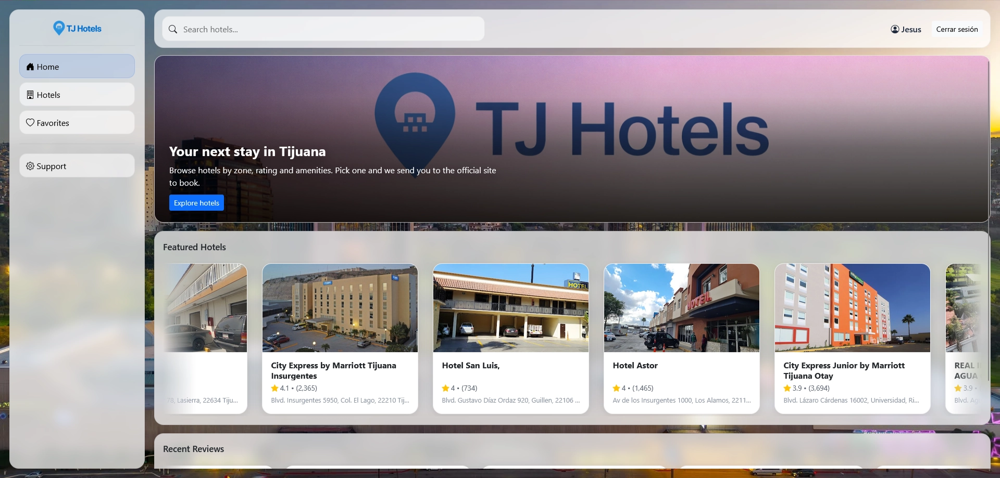
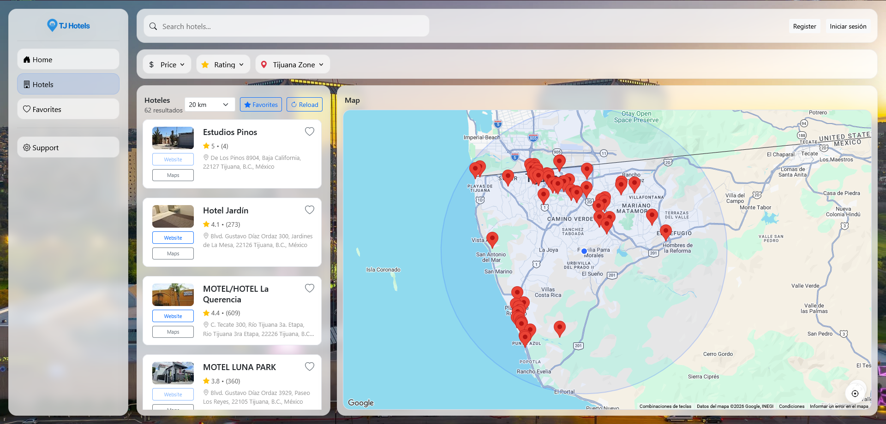
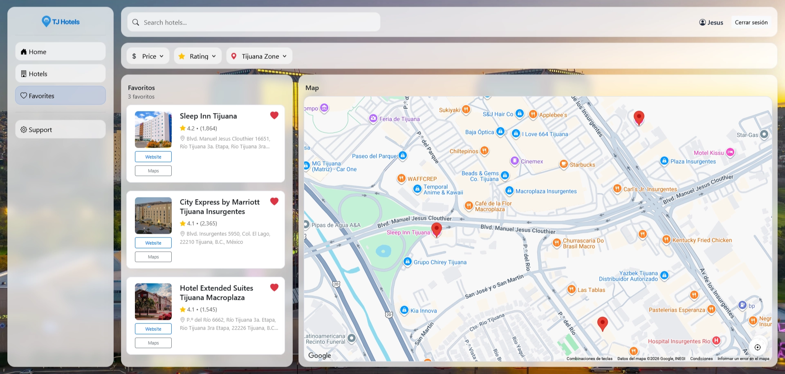
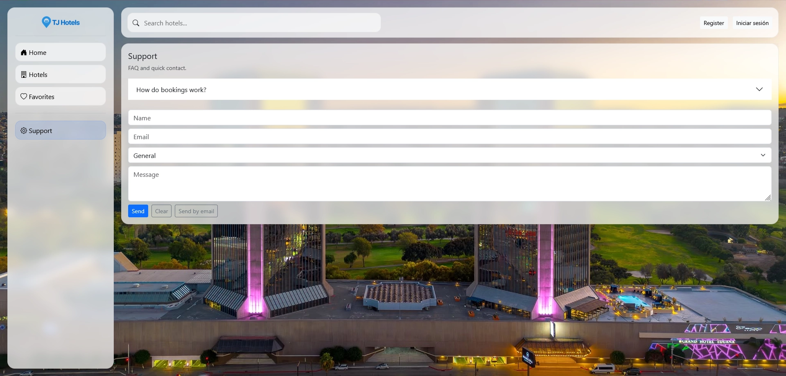

<div align="center">

# TJ Hotels

**Hotel finder for Tijuana on an interactive map, with live data from Google Places**

[](https://flask.palletsprojects.com)
[](https://www.oracle.com/autonomous-database/)

[Live Demo](https://tjhotels.64.181.232.104.nip.io/app) · [Report a Bug](https://github.com/Krackenslung/Food-Stack/issues) · [Request a Feature](https://github.com/Krackenslung/Food-Stack/issues)

</div>

---

## Overview

TJ Hotels solves a concrete problem: finding a place to stay in Tijuana means
jumping between Google Maps, comparison sites and each hotel's own page. This app
puts it in one view — map, filters by zone and rating, and a direct link to the
official site to book.

Hotels are **not stored in a local database**. They are queried live from the
Google Places API, so ratings, photos and reviews are always current. The database
only stores what belongs to the user: their account and their favorites.

The interesting technical challenge was search. Places returns 20 results per query,
and its `radius` parameter **biases** the search instead of filtering it — so
widening the range returned a *different* set of hotels rather than more of them.
The fix was probing several centers and fixed radii, merged by `place_id`: widening
the range can only add results, never remove them.

### Screenshots

**Home page**



**Hotels page**



**Favorites page**



**Support page**



## Features

- **City-wide search** — type a name, brand or zone and it queries Google Places, not just what is already on screen
- **Map with adjustable radius** — 1 to 20 km from your location, with markers and a detail card per hotel
- **Filters by zone, rating and price** — real Tijuana zones (Zona Río, Centro, Otay, Playas), excluding neighboring cities
- **Per-account favorites** — stored in the database, available from any device
- **JWT session in an httpOnly cookie** — the token is never exposed to JavaScript
- **No phantom hotels** — entries without reviews are dropped; Google tags them as `lodging` but they are private homes

## Tech Stack

| Layer | Technology |
|---|---|
| Frontend | Flask (Jinja templates), JavaScript ES Modules, Bootstrap 5, Google Maps JS + Places API |
| Backend | Flask (Blueprints, app factory), PyJWT, bcrypt |
| Database | Oracle Autonomous Database, `python-oracledb` driver (thin mode, mTLS with wallet) |
| Infrastructure | Oracle Cloud Compute, Caddy (automatic HTTPS), gunicorn, systemd |

## Getting Started

### Prerequisites

- Python 3.12
- An Oracle Autonomous Database with its wallet downloaded
- A Google Maps API key with **Maps JavaScript API** and **Places API** enabled

### Installation

```bash
git clone https://github.com/Krackenslung/Food-Stack.git
cd Food-Stack

python -m venv .venv
.\.venv\Scripts\Activate.ps1        # Windows
# source .venv/bin/activate         # Linux / macOS

pip install -r "BackEnd Server/requirements.txt"
pip install -r "FrontEnd Server/requirements.txt"

cp "BackEnd Server/.env.example"  "BackEnd Server/.env"
cp "FrontEnd Server/.env.example" "FrontEnd Server/.env"
```

Create the schema by running `Hotels_oracle.sql` in **Database Actions → SQL** from
the Oracle Cloud console.

Then start both servers, each in its own terminal:

```bash
cd "BackEnd Server"  && python server.py     # http://127.0.0.1:5010
cd "FrontEnd Server" && python server.py     # http://127.0.0.1:5020
```

The app runs at `http://127.0.0.1:5020`.

### Environment Variables

**`BackEnd Server/.env`**

| Variable | Description | Required |
|---|---|---|
| `ORACLE_USER` | Database user (`ADMIN` by default) | Yes |
| `ORACLE_PASSWORD` | Password for that user | Yes |
| `ORACLE_DSN` | Alias from the wallet's `tnsnames.ora` (`tjhotels_low`) | Yes |
| `ORACLE_WALLET_DIR` | Folder where the wallet was unzipped | Yes |
| `ORACLE_WALLET_PASSWORD` | Wallet password | Yes |
| `JWT_SECRET` | Token signing key (`openssl rand -hex 32`) | Yes |
| `TOKEN_HOURS` | Session lifetime, defaults to 2 | No |
| `FRONTEND_ORIGIN` | Origin allowed by CORS | Yes |

**`FrontEnd Server/.env`**

| Variable | Description | Required |
|---|---|---|
| `GOOGLE_MAPS_API_KEY` | Google Maps API key | Yes |
| `API_BASE` | Backend URL: `http://127.0.0.1:5010` locally, `/api` behind a proxy | Yes |

> Never commit your `.env`. Keep `.env.example` in sync with the values removed.

> The Maps key is visible in the browser by design. The real protection is an
> **HTTP referrer** restriction in Google Cloud Console.

## Usage

1. Open `/register` and create an account.
2. Sign in at `/login`.
3. Under **Hoteles**, set the radius and filter by zone, rating or price.
4. Use the search bar to find a hotel by name, brand or zone across the whole city.
5. Save favorites with the heart icon — they are tied to your account.

## Project Structure

```
Food-Stack/
├── BackEnd Server/          # REST API (port 5010)
│   ├── controllers/         # Blueprints: users, locations, favorites, support
│   ├── models/              # Classes owning all SQL and the Oracle connection
│   ├── security/            # JWT and the require_auth decorator
│   ├── config.py            # Loads the .env
│   └── utils.py             # Response envelope and error handling
├── FrontEnd Server/         # Template server (port 5020)
│   ├── templates/           # app.html, login.html, register.html
│   └── static/js/modules/   # hotelsMap, favoritesMap, favorites, session, views…
├── deploy/                  # Caddyfile, systemd units and deployment guide
├── docs/                    # Screenshots used by this README
├── Hotels_oracle.sql        # Oracle schema
└── Hotels.sql               # Original SQL Server schema (historical)
```

## Roadmap

- [x] Live hotels from Google Places
- [x] Authentication with a JWT in an httpOnly cookie
- [x] Favorites stored per account
- [x] City-wide search, not just over already-loaded results
- [x] Migration from SQL Server to Oracle Autonomous Database
- [x] Deployment with HTTPS
- [x] Rank featured hotels by quality (`rating × log(reviews)`) instead of raw rating
- [x] Dedicated database user instead of `ADMIN`
- [x] Backend for the support form (`POST /support`), replacing `localStorage`

## Contributing

Fork the repo, create a branch (`git checkout -b feat/thing`), commit, and open a
pull request. Issues and suggestions are welcome.

## License

Copyright (c) 2026 Jose Luis Gonzalez Lozayo, Jesus Martin Gallardo.
All rights reserved. This project is published for portfolio purposes only;
it is not licensed for reuse, modification or redistribution.

## Contact

Jose Luis Gonzalez Lozayo and Jesus Martin Gallardo — [GitHub](https://github.com/Krackenslung) · quechumartin@hotmail.com
